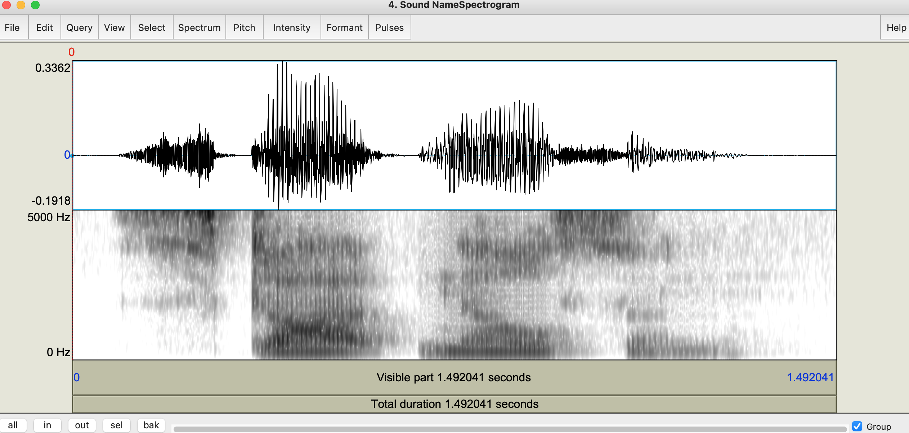
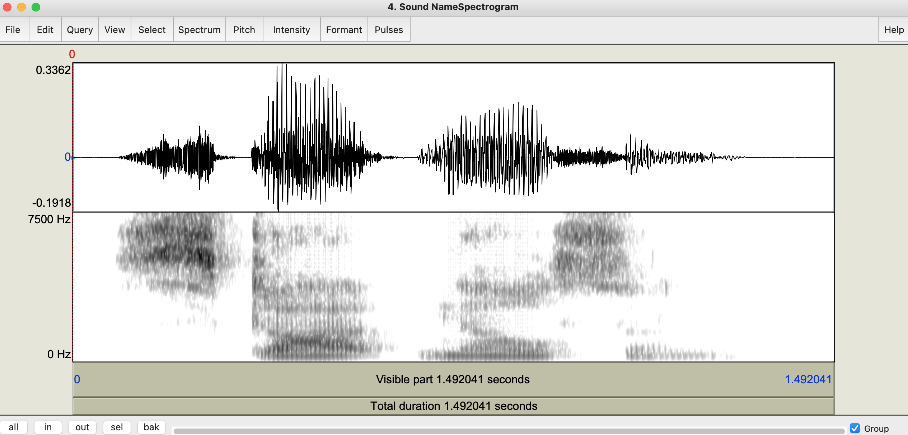
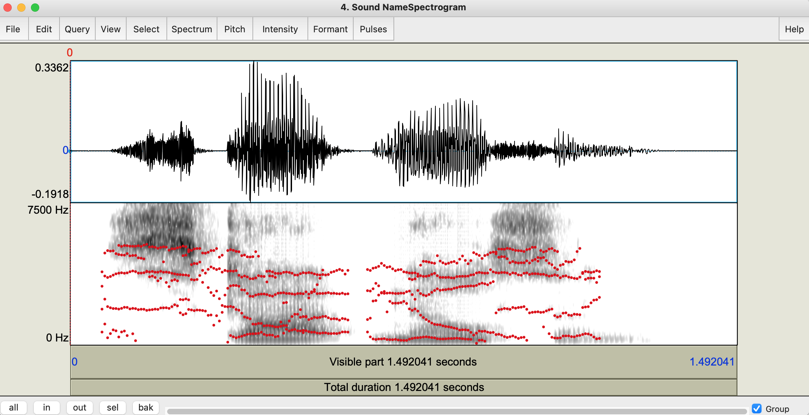
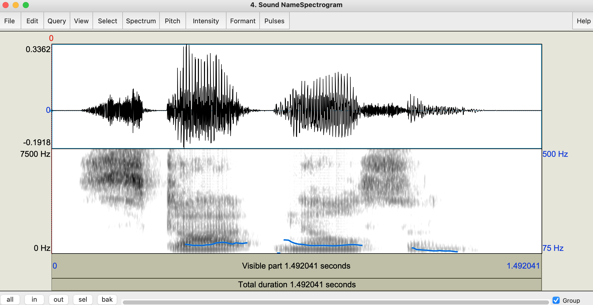
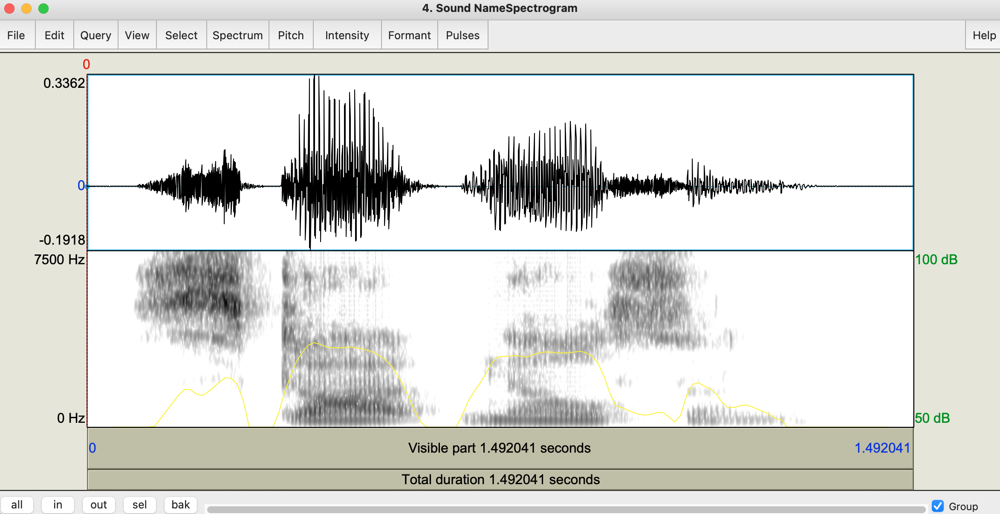
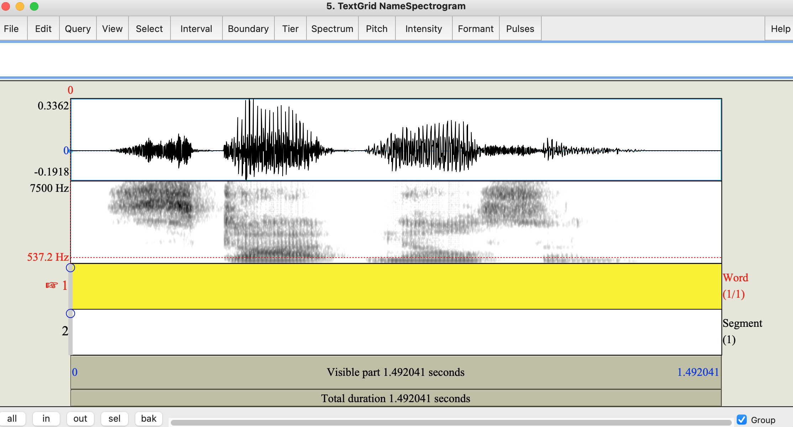
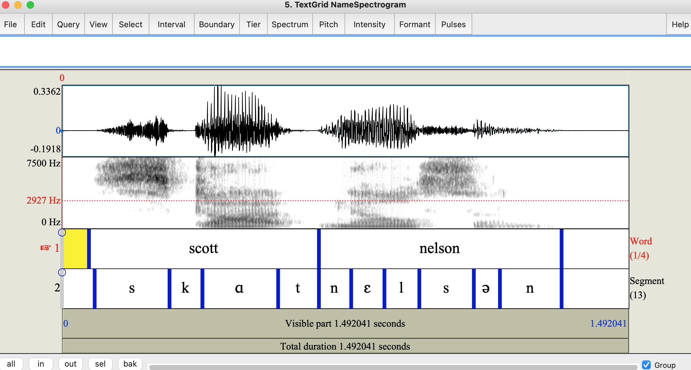

*** 

# 1. Overview 

Praat (pronounced /pɹɑt/) is a free, open-source program created by Paul Boersma and David Weenink at the University of Amsterdam. It has many functions, but is primarily used to analyze speech. This site provides basic information on how to get started using Praat for linguistic research. Along the way we will do three basic acoustic analyses: measuring vowel formants, voice onset time (VOT), and pitch values. I will assume a basic understanding of these concepts. If you are interested in learning more about acoustic (linguistic) phonetics I recommend reading [this book](https://www.wiley.com/en-us/Acoustic+and+Auditory+Phonetics%2C+3rd+Edition-p-9781444343083) by Keith Johnson, [this book](https://press.uchicago.edu/ucp/books/book/chicago/E/bo3683670.html) by Peter Ladefoged, or, if you are really ambitious, [this book](https://mitpress.mit.edu/books/acoustic-phonetics) by Ken Stevens.

***

# 2. Installation 

To install Praat, go to [praat.org](https://www.fon.hum.uva.nl/praat/) and click on the link in the top left corner corresponding to your operating system. This will bring you to a page that will guide you through the installation process.

***

# 3. Recording sounds and working with sound files

When you first open Praat you will see two windows. One will be called `Praat Objects` and the other will be called `Praat Pictures`. We will ignore the `Praat Pictures` window for now. In the `Praat Objects` window you should see a big white box that says "Objects:". There should be nothing in there as of right now. The most important type of object is a `Sound` object. Let's start by learning how to record sounds directly into Praat.

1. At the top of the `Praat Objects` window click `New > Record mono Sound...`.
2. A new window called `SoundRecorder` should now pop up.
    * If you have a microphone of some type plugged in, you can make sure it is being used as the audio capture device by making sure it is selected under "Input source:".
    * You can also change the sampling frequency if necessary. It defaults to 44.1 KHz.
3. To actually record a sound you can click the `Record` button. When finished, click `Stop`.
4. You can listen back to what you just recorded by clicking `Play`.
5. If you are satisfied with the recording, you can label the recording by typing in the box to the right of "Name:". After doing so, you can click `Save to list` which will save your current recording to the `Praat Objects` window and allow you to make another recording or click `Save to list & Close` which will save your current recording to the `Praat Objects` window and exit out of the `SoundRecorder` window.

In the `Praat Objects` window you should now see `1. Sound <name of sound object>`. You can ignore the numbering. Every time a new object is added to the list during a single Praat session that number increases by 1. This means that the same file can technically show up with different numbers at different times. We can see how that is the case by saving our sound file, removing it from the `Praat Objects` window and then loading the file back into our workspace. To save a `Sound` object you can click `Save > Save as WAV file...`. There are other file formats available for saving audio, but WAV is pretty much the universal standard for our purposes. Save the recording you made somewhere on your computer where it will be easy to find. 

Once you are back at the `Praat Objects` window click on the `Sound` object. In the bottom left corner there is a button that says `Remove`. Click this to remove the recording. The "Objects:" box should now be empty like it was when you first opened Praat. Let's now add our recording back into the `Praat Objects` window. At the top, click `Open > Read from file...`. Open the sound we previously recorded by navigating to where you saved it on your computer. The `Praat Objects` window should now show `2. Sound <name of sound object>` (notice the incremented number). 

You can also work with sound files that were not recorded using Praat. For these types of files, you can open them directly from wherever they are saved on your computer.

***

# 4. Viewing Spectrograms

One way to do acoustic analysis of speech is by visual interpreting a spectrogram. A spectrogram is a visual picture of the speech signal. The x-axis corresponds to time, the y-axis corresponds to frequency (Hz), and the z-axis (represented as darkness level) corresponds to amplitude. 

To view a spectrogram of a `Sound` object, first select the object you want to view in the `Praat Objects` window.
Once it is selected, a number of buttons should appear on the right side of the window. Select `View & Edit`. After doing so, a window called `<object number> Sound <name of sound object>` will appear. The top half of this window contains the waveform. A waveform is the overall amplitude change over time. The bottom half of the window contains the actual spectrogram. It should look something like the image below. 
  

  
The default spectrogram settings [are not always ideal](https://twitter.com/lisa_b_davidson/status/698249575317032960). You can change the settings by clicking `Spectrum > Spectrogram settings...`. This will cause a window called `Spectrogram settings` to pop up. I usually change the view range by adjusting the right box next to "View range (Hz):" from 5000 to 7500. I also change the dynamic range by adjusting the box to the right of "Dynamic range (dB):" from 70 to 50. If you mess around with the settings and suddenly things start looking strange, you can always click the `Standards` button on the bottom of the window to reset all the parameters to their default settings. If you would like to see what the settings would look like before leaving the `Spectrogram settings` window you can click `Apply`. As long as the `<object number> Sound <name of sound object>` window is still visible you can see the changes in real time. Once you change the settings you can click `OK` to get rid of the `Spectrogram settings` window. The updated version of the spectrogram is shown below.
  

  
There are a few other things we can do that may help with our interpretation of the spectrogram. These are listed below.

## Formants
Formants are the de facto method for measuring basic vowel quality. Specifically, the first two formants (F1 and F2). Trained phoneticians can often eyeball the location of the formants, but Praat has an algorithm for determining a formant value at any location and will show this if prompted. At the top of the `<object number> Sound <name of sound object>` window click `Formant > Show formants`. You should see a bunch of red dots appear, forming lines throughout the spectrogram. Determining which line corresponds with F1 and F2 is done by counting up from the bottom. F1 is the first line starting from 0 Hz, F2 is the second line,, and so on. You can determine the F1 and F2 values at a given time by clicking on the red dot/line for the formant. A red number on the left hand side will show you the value. The image below shows an example of what your window should look like. To get rid of the formant tracking, click `Formant > Show formants` again and they should disappear. 
  

  

## Pitch
Pitch can be used for different types of acoustic analysis. For example, you may want to look at the pitch pattern over an entire phrase if you are studying the prosody of a language. Or, if you are interested in the tonal properties of a language, you can look at the pitch location and shape over a single tone bearing unit. To visualize the pitch, click `Pitch > Show pitch`. This time, a blue line should appear on the spectrogram. You can see what the exact pitch value is at any given time by clicking at a specific time on the spectrogram. If pitch can be calculated at that moment, you will see a blue number appear on the right side of the spectrogram. If pitch can't be calculated, you will only see the 75 Hz and 500 Hz limits. The image below shows an example of what your window should look like. To get rid of the pitch tracking, click `Pitch > Show pitch` again and it should disappear. 

  

  

## Intensity
The final thing you may want to visualize is the intensity. This is sometimes useful for determining where one segment may start or end. It also corresponds with the wave form in the top of the window, but is still helpful in my opinion. To visualize the intensity click `Intensity > Show intensity`. If you click anywhere on the spectrogram, if the intensity value is greater than 50 dB you will see a green number appear on the right hand side. Otherwise, you will see the 50 dB and 100 dB limits. To get rid of the intensity tracking, click `Intensity > Show intensity` again and it should disappear. 
  

  

***

# 5. TextGrids

TextGrids in Praat are another type of object in Praat. These are used to annotate the spectrogram. To create a TextGrid, first select the `Sound` object you want to annotate, then click `Annotate - > To TextGrid...` on the right hand side of the `Praat Objects` window. This will cause a new window to pop up named `Sound: To TextGrid`. In the top box next to "All tier names:" you can type in the name of the tiers you want to add. You can separate each tier with a space. For our purposes I will create two tiers: "Word" and "Segment". The bottom box next to "Which of these are point tiers?" can be left blank for now. The default type of tier is an `Interval tier` which has a starting and ending point. A `Point tier` is instead a single point. We will see how these work later.

After hitting `OK`, you should notice that there is a new object in the `Praat Objects` window called `<object number> TextGrid <name of TextGrid object>`. You can view a TextGrid on its own, but this is ultimately not helpful. To view it with the spectrogram, make sure that both the `Sound` object and the `TextGrid` object are selected. Once they are both selected, click `View & Edit` on the right hand side of the `Praat Objects` window. The spectrogram window will pop up again but this time it will look a little different. Below the spectrogram there are two rows that correspond to the tiers of the TextGrid and on the right hand side you should see a bunch of IPA symbols. These are for entering IPA symbols while labeling your tiers. Praat does kind of weird stuff with IPA symbols so I recommend not using these and instead entering them with your IPA keyboard. You can also get rid of the IPA symbols completely by clicking `File > Preferences...` and then un check the box next to "Show IPA chart". Click `OK` and the IPA symbols should go away. It should now look like the picture below.
  

  

Let's populate our tiers now. First we can start with the "Word" tier. Here, we want to create intervals at the word level. For my recording, there will be two words: **Scott** and **Nelson**. There are a few different ways you can mark an interval on a tier. You can select a tier by clicking anywhere on it. The active tier should be yellow. Make sure that tier 1 ("Words") is highlighted. Then click on the spectrogram a little bit before the beginning of the word. You should see a dashed red line marking where you'd like to place a boundary. Before marking it on the tier, it's good practice to make sure that you are selecting a point at a zero-crossing. To do this, click `Select > Move cursor to nearest zero crossing`. One way to create a boundary marker is by clicking the open circle on the desired tier. A second (and faster) way is to click `Enter` on your keyboard. This will create the boundary marker on the selected tier. Finally, you can click `Boundary > Add on selected tier` or `Boundary > Add on tier 1`. We can do the same thing for the end of the word. We now have an interval. You can do the same thing for other words on your recording. The same process can be used for the "Segment" tier, but now you just mark the start/stop points of the segments rather than the words. After completion you should get something that looks like the image below.
  

  

TextGrids can be saved from the `Praat Objects` window as well. Make sure that the TextGrid you want to save is highlighted and then click `Save > Save as text file...`. 

# 6. Doing a basic analysis

Now that you have a marked up recording, it is time to do an analysis. For a simple recording (like my name) it is possible to perform all the measurements by hand. With the recording of my name you could find the F1 and F2 values of all the vowels, measure the duration of stressed vs. unstressed vowels, find the peak intensity of a stressed /s/ vs. unstressed /s/ in onset, etc... Of course, on this small of a sample size, doing so would be little more than a fun exercise. 

It is much quicker, accurate (to the extent that Praat is accurate), and scalable if you automate your analysis. Praat has a built in scripting system that allows you to write custom scripts. We don't have time and not everyone enjoys coding so I will not go through how to *write* a Praat script here, but you should know how to *run* a Praat script as it will save you lots of time!

If you are interested in learning how to write your own scripts in Praat I would suggest [this tutorial](https://praatscripting.lingphon.net) or [this tutorial](http://praatscriptingtutorial.com/default). There is also a built in tutorial in the Praat help menu, but I have always found it to be lacking. 

There are many places to find custom scripts online. Some people who I have borrowed from include [Will Style](https://github.com/stylerw/styler_praat_scripts), [Matt Winn](http://www.mattwinn.com/praat.html), and [Christian DiCanio](https://www.acsu.buffalo.edu/~cdicanio/scripts.html). There are plenty more out there.

For this tutorial we will use two scripts that I wrote. We will use them to analyze vowel and VOT data from the Takestani dialect of Southern Tati. This is data that was gathered as part of a Field Methods course at Stony Brook University during the Spring 2022 semester. 

## Part 1: Vowel Analysis

To begin, download the [data](Praat/Vowels.zip) and the [script](Praat/vowelData.praat). Unzip the folder to find individual WAV and TextGrid files for ~ 25 words. 
