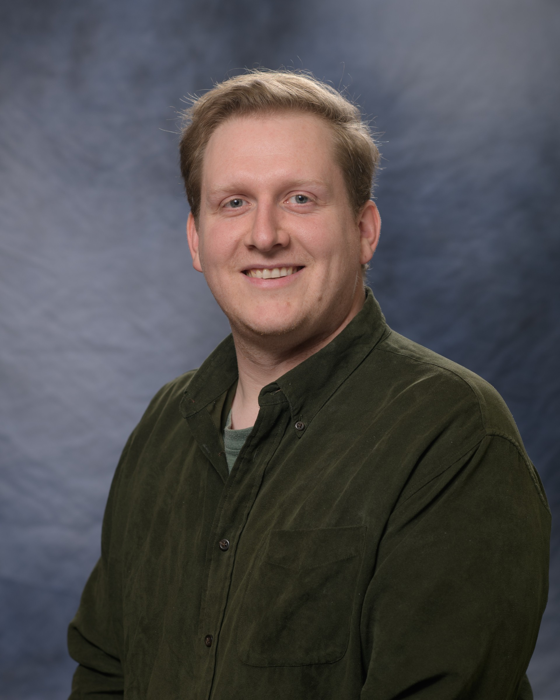

I am an Assistant Professor in the [Department of Linguistics](https://linguistics.illinois.edu) at the University of Illinois Urbana-Champaign.
My broad research interests include the phonetics-phonology interface, phonological representations, and computational/model-theoretic phonology.
I received my PhD in Linguistics from [Stony Brook University](https://www.linguistics.stonybrook.edu) in 2024. While at Stony Brook I was also affiliated with the [Institute for Advanced Computational Science](https://iacs.stonybrook.edu/index.php).  I was advised by [Jeffrey Heinz](http://jeffreyheinz.net). Before attending Stony Brook, I received my MA and BA in Linguistics from Michigan State University where I was advised by [Karthik Durvasula](https://karthikdurvasula.gitlab.io). You can find a current copy of my CV [here](pics/cv.pdf). If you would like to find out more information about me, please look around this website or **send me an e-mail:** sjnelson[at]illinois[dot]edu.

When I'm not doing linguistics, I like to {write,record,perform,listen to} music. I spent a decade of my life traveling around in a van with my friends performing music for strangers. My love for all things sound is ultimately what drew me to phonetics and phonology.

------------------------------------------------------------------------

# **Research**

> "...the overt aspects of language -- the articulatory actions and the acoustic signal they produce -- cannot be properly understood without reference to the covert aspect of language." - Morris Halle 

## Specific Interests

Language production and perception involve many factors. My research seeks to explain how these different factors interact. Primarily, I am interested in the nature of phonological knowledge and how it interacts with the sensory-motor system. I take the perspective that this is best answered by looking into the computational and representational properties of the transformations between continuous speech data and discrete symbolic mental units. In general, there are three questions to be considered:

1. How do we best characterize the output function? (production)
2. How do we best characterize the input function? (perception)
3. How do we best characterize the mental representations that mediate between the two?

In my dissertation, *The Computational Structure of Phonological and Phonetic Knowledge*, I primarily addressed questions 1 and 3. 
I introduced what I call **The Blueprint Model of Production** which is a computational characterization of the production side of the phonetics-phonology interface. 
It provides an explanation for phenomena like incomplete neutralization and variation in homophone duration without needing to abandon discrete phonological knowledge. 
I also show how articulatory-based representations can be easily generated directly from symbolic strings, which supports more abstract theories of representation. 
My current research plans involve using the BMP to analyze more empirical phenomena and expand the computational side to include a perception aspect. 

Because of the nature of the data, my research has involved both experimental and formal methods. I also work on model-theoretic phonology. In that domain I find myself consistently thinking about process interactions. Most of my abstracts contain some combination of the keywords: ``phonetics-phonology interface``, ``phonological representations``, ``computation``, and ``model-theoretic phonology``.
Lately, I have also been interested in how optionality and variability play a roll in the larger framework I have been developing. 

## Publications

### Journal Articles

-   **Nelson, S.** & Heinz, J. 2025. "[The Blueprint Model of Production](https://www.cambridge.org/core/journals/phonology/article/blueprint-model-of-production/8F5DCE3962C064DA547FD44B5BD21218)". *Phonology*

-   Taherkhani, N. & **Nelson, S.** 2024. "[Southern Tati: Takestani Dialect](https://www.cambridge.org/core/journals/journal-of-the-international-phonetic-association/article/abs/southern-tati-takestani-dialect/9C2D1269604E1F8AAC18EAE6C7E92A5C)". *Journal of the International Phonetic Association*.

-   **Nelson, S** & Durvasula, K. 2021. "[Lexically-Guided Perceptual Learning does Generalize to New Contexts](https://www.sciencedirect.com/science/article/abs/pii/S0095447020301108)". *Journal of Phonetics*.

### Proceedings
-   **Nelson, S**. 2024. "Optionality and the Phonetics-Phonology Interface". *Proceedings of the 42nd West Coast Conference on Formal Linguistics*.

-   **Nelson, S**. & Baković, E. 2024. "[Underspecification without Underspecified Representations](https://openpublishing.library.umass.edu/scil/article/id/2227/)". *Proceedings of the Society for Computation in Linguistics*, 7(1), 352-356.

-   **Nelson, S**. 2022. "[A Model Theoretic Perspective on Phonological Feature Systems](https://scholarworks.umass.edu/scil/vol5/iss1/2/)". *Proceedings of the Society for Computation in Linguistics*, 5(1), 1-10.

-   **Nelson, S** & Heinz, J. 2022. "[Incomplete Neutralization and the Blueprint Model of Production](http://journals.linguisticsociety.org/proceedings/index.php/amphonology/article/view/5304)". In Peter Jurgec, Liisa Duncan, Emily Elfner, Yoonjung Kang, Alexei Kochetov, Brittney K. O'Neill, Avery Ozburn, Keren Rice, Nathan Sanders, Jessamyn Schertz, Nate Shaftoe, and Lisa Sullivan (eds.), *Proceedings of the 2021 Annual Meeting on Phonology*. Washington, DC: Linguistic Society of America.

-   Pue, A. Sean & **Nelson, S**. 2018. "Marking Poetic Time: Building and Annotating a Hindi-Urdu Poetry Corpus for Computational Humanities Research." *Proceedings of the Second Workshop on Corpus-based Research in the Humanities (CRH-2)*, 171-180.

-   Durvasula, K. & **Nelson, S**. 2018. "[Lexical Retuning Targets Features](http://journals.linguisticsociety.org/proceedings/index.php/amphonology/article/view/4237)". In Gallagher, Gillian, Gouskova, Maria, and Sora Yin (eds.), *Proceedings of the 2017 Annual Meeting on Phonology*. Washington, DC: Linguistic Society of America.

## Manuscripts

-   **Nelson, S**. "On the formal equivalence of phonological strings and gestural representations".
-   **Nelson, S**. & Baković, E. "Feature spreading, redundancy, and blocking".
-   **Nelson, S**. "The logic and typology of derived environment effects".
-   Taherkhani, N., **Nelson, S.** & Heinz, J. "Vowel alternations as evidence for contrastive vowel features in Southern Tati: Takestani dialect"
-   Heinz, J. & **Nelson, S.** "The Past, Present, and Future of Model-Theoretic Phonology".

## Presentations and Posters

- **Nelson, S.** (2026). Formalizing phonological knowledge verses usage with weighted logic. Old-World Conference in Phonology 23 (OCP2023). University of Cambridge. Cambridge, UK, England.

- **Nelson, S.** & Baković, E. (2026). Feature spreading and redundancy with BMRS. Old-World Conference in Phonology 23 (OCP23). University of Cambridge. Cambridge, UK, England. 

- **Nelson, S.** (2026). Discrete Interpretations of Continuous Representations in Model-Theoretic Computational Phonology. Workshop on The Role of Representation in Computational Phonology. University of Cambridge. Cambridge, UK, England. 

- **Nelson, S.** (2026). Phonological Knowledge, Weighted Logic, and the Competence/Performance Distinction. Annual Meeting of the Linguistic Society of America (LSA). New Orleans, LA, USA.

- **Nelson, S.** & Baković, E. (2026). A BMRS analysis of Trojan vowels in Hungarian vowel harmony. Annual Meeting of the Linguistic Society of America (LSA). New Orleans, LA, USA. 

- Hayes, M. & **Nelson, S.** (2026). Poetic Rhyme as a Tier-Based Strictly Local Constraint. Annual Meeting of the Linguistic Society of America (LSA). New Orleans, LA, USA.

- Stephanov, A. & **Nelson, S.** (2025). Formalizing the Venetian ‘Evanescent’ /l/: A Three-Perspective Analysis. Going Romance 2025. Ca' Foscari University of Venice, Venice, Italy.

- Stephanov, A. & **Nelson, S.** (2025). Formalizing the Venetian ‘Evanescent’ /l/: A Three-Perspective Analysis. Annual Meeting on Phonology 2025 (AMP). University of California Berkeley. Berkeley, CA, USA. 

- **Nelson, S.** (2025). [Using Model Theory and Function Types to Formally Relate Symbolic and Dynamic Theories of Speech](Presentations/dymos2025-Nelson.pdf). Dynamic Models of Speech (DYMOS). University of Oregon. Eugene, OR, USA.

- **Nelson, S.** (2025). [Phonological Knowledge, Weighted Logic, and the Competence/Performance Distinction](Presentations/naphc2025-Nelson.pdf). North American Phonology Conference 13 (NAPHC). Concordia University, Montreal, Quebec, CA. 

- **Nelson, S.** & Baković, E. (2024). [Computation Clarifies Mixed Specification Behavior of Coronals in English](Presentations/amp2024-NelsonBakovic.pdf). Annual Meeting on Phonology 2024 (AMP). Rutgers University, New Brunswick, NJ, USA.

- **Nelson, S.** (2024). [Coronal is Never Underspecified in English: a Computational View](Presentations/midphon2024-Nelson.pdf). 29th Annual Mid-Continental Phonetics & Phonology Conference (MidPhon). University of Illinois Urbana-Champaign, Urbana, IL, USA. 

- **Nelson, S.** (2024). [BMRS and Underspecification](Presentations/rspw2024-Nelson.pdf). Rutgers Subregular Phonology Workshop. Rutgers University. New Brunswick, NJ, USA.

- **Nelson, S.** & Baković, E. (2024). [Underspecification without Underspecified Representations](Presentations/scil2024-NelsonBakovic.pdf). Society for Computation in Linguistics 2024 (SCiL). University of California Irvine. Irvine, CA, USA.

- **Nelson, S.** (2024). [Optionality and the Phonetics-Phonology Interface](Presentations/wccfl2024-Nelson.pdf). 42nd West Coast Conference on Formal Linguistics (WCCFL). University of California Berkeley. Berkeley, CA, USA.

- Chandlee, J., Jardine, A., & **Nelson, S.** (2024). [Tutorial: Logic and Model Theory for Phonology](Presentations/lsa2024-ChandleeJardineNelson.pdf). Annual Meeting of the Linguistic Society of America (LSA). New York, New York, USA.

- **Nelson, S.** (2023). [Unordered rules that only apply to the input are not more complex than ordered rules](Presentations/m1002023-Nelson.pdf). M100. Massachusetts Institute of Technology. Cambridge, MA, USA.

- **Nelson, S.** (2023). [Model Theoretic Phonology and Theory Comparison: Segments, Gestures, and Coupling Graphs](Presentations/naphc2023-Nelson.pdf). North American Phonology Conference 12 (NAPhC). Concordia University, Montreal, Quebec, Canada.

-   Taherkhani, N., **Nelson, S.**, & Heinz, J. (2023). [A Contrastive Hierarchy for Vowels in Southern Tati: Takestani Dialect](Presentations/nacil2023-TaherkhaniNelsonHeinz.pdf). North American Conference in Iranian Linguistics 3 (NACIL). University of California Los Angeles, Los Angeles, CA, USA.

-   **Nelson,S.** (2022). [Are Representations in Articulatory and Generative Phonology so different?](Presentations/amp2022-Nelson.pdf). Annual Meeting on Phonology 2022 (AMP). University of California Los Angeles, Los Angeles, CA, USA.

-   **Nelson, S.** (2022). [Gestures, Coupling Graphs, and Strings](Presentations/wmtrp2022-Nelson.pdf). Workshop on Model Theoretic Representations in Phonology (WMTRP). Stony Brook University, Stony Brook, NY, USA.

-   Heinz, J. & **Nelson, S.** (2022). [The Past, Present, and Future of Model Theoretic Phonology](Presentations/wmtrp2022-HeinzNelson.pdf). Workshop on Model Theoretic Representations in Phonology (WMTRP). Stony Brook University, Stony Brook, NY, USA.

-   **Nelson, S.** (2022). [A Model Theoretic Perspective on Phonological Feature Systems](Presentations/scil2021-Nelson.pdf). Society for Computation in Linguistics 2022 (SCiL).

-   **Nelson, S.** & Heinz, J. (2021). [Incomplete Neutralization and the Blueprint Model of Production](Presentations/amp2021-NelsonHeinz.pdf). Annual Meeting on Phonology 2021 (AMP). University of Toronto, Toronto, Ontario, Canada.

-   **Nelson, S.** (2021). [What can logic and model theory tell us about phonological feature systems?](Presentations/phone2021-Nelson.pdf) Phonology in the Northeast 2021 (PhoNE). New York University, New York, New York, USA.

-   **Nelson, S.** (2020). [The logical language of phonological features](Presentations/necphon2020-Nelson.pdf). Northeastern Computational Phonology Workshop 2020 (NECPhon). Maryland University. College Park, Maryland, USA.

-   **Nelson, S.** & Heinz, J. (2020). [Incomplete Neutralization is no Problem for Formal Phonology](Presentations/wtph2020-NelsonHeinz.pdf). Workshop on Theoretical Phonology 2020 (WTPh). Concordia University. Montreal, Quebec, Canada.

-   **Nelson, S.** (2019) [Generalization in the absence of variation within lexical retuning](Presentations/lsa2019-Nelson.pdf). Annual Meeting of the Linguistic Society of America (LSA). New York, New York, USA.

-   **Nelson, S.** (2018). [Lexical retuning is not the same as audio-visual retuning: the former generalizes better](Presentations/midphon2018-Nelson.pdf). 23rd Annual Mid-Continental Phonetics & Phonology Conference (MidPhon). Northwestern University. Evanston, Illinois, USA.

-   Durvasula, K. & **Nelson, S.** (2018). [Retuning generalizes to new contexts](Presentations/labphon2018-DurvasulaNelson.pdf). 16th Conference on Laboratory Phonology (LabPhon). University of Lisboa. Lisboa, Portugal.

-   Pue, A. Sean & **Nelson, S.** (2018). Marking Poetic Time: Building and Annotating a Hindi-Urdu Poetry Corpus for Computational Humanities Research. Corpus-based Research in the Humanities 2, Austrian Academy of Science. Vienna, Austria.

-   Durvasula, K. & **Nelson, S.** (2017). [Perceptual retuning targets features](Presentations/amp2017-DurvasulaNelson.pdf). Annual Meeting on Phonology 2017 (AMP). New York University. New York, New York, USA.

------------------------------------------------------------------------

# **Teaching**

I currently work as an Instructor in the Department of Linguistics at the University of Illinois Urbana-Champaign. My office is located in LCLB 4117. I have regularly scheduled office hours on Wednesdays and Fridays from 12:30-2:00pm.
If you are a student in one of my classes, please got my [YouCanBookMe](https://snelson89.youcanbook.me) page to schedule a time to meet. If you are not my student, or if those time/meeting lengths do not work for you, please send me an e-mail. We can find a time to meet either remotely or in person.Below is a list of classes I have served as either a teaching assistant or main instructor for. 

In 2023 I was a recipient of the Stony Brook [President's Award for Excellence in Teaching by a Graduate Student](https://grad.stonybrook.edu/awards/President_Teaching.php).

## University of Illinois Urbana-Champaign

### Main Instructor

-   **LING 304**: *Elements of Morphology* 
    -   Spring 2025
-   **LING 401**: *Intro to General Phonetics*
    -   Fall 2024
-   **LING 490**: *Computation and Phonological Theory*
    -   Spring 2025
-   **LING 502**: *Phonology I*
    -   Spring 2025; Fall 2025
-   **LING 542**: *Phonology II*
    -   Fall 2024

## Stony Brook University

### Teaching Assistant

-   **LIN 101**: *Introduction to Linguistics*
    -   Spring 2020
-   **LIN 120**: *Language and Technology*
    -   Fall 2020
-   **LIN 201**: *Phonetics*
    -   Fall 2019; Fall 2021; Spring 2022
-   **LIN 235**: *Signed Languages & Deaf Communities*
    -   Spring 2024
-   **LIN 301**: *Phonology*
    -   Spring 2021; Fall 2022; Fall 2023
-   **LIN 538**: *Statistics for Linguistics*
    -   Spring 2023

### Main Instructor

-   **LIN 200**: *Language in the United States*
    -   Winter 2022 (Co-taught with [Andrija Petrovic](https://andrija-petrovic.github.io))
-   **LIN 350**: *Experimental Phonetics*
    -   Summer [2023](350SU23.html)
-   **LIN 405**: *Writing in Linguistics*
    -   Summer [2021](405SU21.html)
-   **LIN 522**: *Phonetics*
    -   Summer 2020; Summer 2022 (Co-taught with [Felix Fonseca Quesada](https://sites.google.com/view/felixfonsecaquesada/página-principal))

## Additional Instruction

### Head Instructor

-   Stony Brook University Youth Camp in Computational Linguistics
    -   Summer 2021; Summer 2022
-   Stony Brook Linguistics Department Statistics Minicourse
    -   Summer 2023
-   New York Institute
    -   Winter/[Summer 2024](files/mathling-summer2024.pdf) (Introduction to Mathematical Linguistics co-taught with [Vinny Czarnecki](https://www.vinczarnecki.com))

### Volunteer

-   Institute for Advanced Computational Science Data + Computation = Discovery!
    -   Summer 2024
-   Stony Brook University NACLO Practice Session
    -   Winter 2021; Winter 2022; Winter 2024
-   Stony Brook University Youth Camp in Computational Linguistics
    -   Summer 2020; Summer 2023; Summer 2024
-   Stony Brook School Linguistics Minicourse
    -   Winter 2022

## Workshop Materials, Handouts, Tutorials, etc...

-   [Introduction to Praat](Praat.html)
-   [Introduction to Montreal Forced Aligner](MFA.html)
