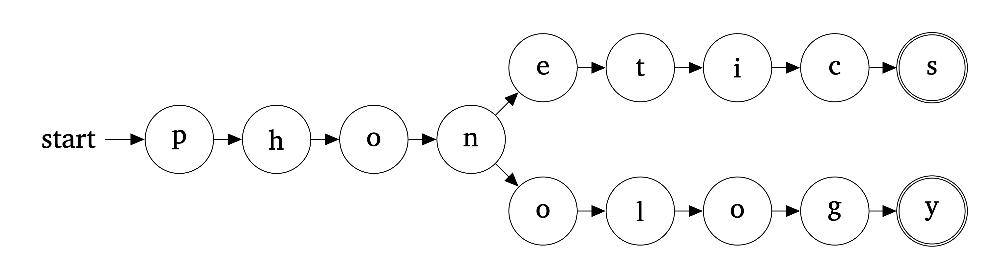

I am a PhD candidate in the [Department of Linguistics](https://www.linguistics.stonybrook.edu) at Stony Brook University. I am also affiliated with the [Institute for Advanced Computational Science](https://iacs.stonybrook.edu/index.php). My research interests include the phonetics-phonology interface, phonological representations, and computational/model-theoretic phonology. I am advised by [Jeffrey Heinz](http://jeffreyheinz.net). Before attending Stony Brook, I received my MA and BA in Linguistics from Michigan State University where I was advised by [Karthik Durvasula](https://karthikdurvasula.gitlab.io). You can find a current copy of my CV [here](pics/cv.pdf). If you would like to find out more information about me, please look around this website or **send me an e-mail:** scott[dot]nelson[at]stonybrook[dot]edu.

When I'm not doing linguistics, I like to {write,record,perform,listen to} music. I spent a decade of my life traveling around in a van with my friends performing music for strangers. My love for all things sound is ultimately what drew me to phonetics and phonology.

------------------------------------------------------------------------

# **Research**

## Specific Interests

Language production and perception involve many factors. My research seeks to explain how these different factors interact. Primarily, I am interested in how the formal phonological system interacts with the sensory-motor system. I take the perspective that this is best answered by looking into the computational and representational properties of the transformations between continuous speech data and discrete symbolic mental units. In general, there are three questions to be considered:

1. How do we best characterize the output function? (production)
2. How do we best characterize the input function? (perception)
3. How do we best characterize the mental representations that mediate between the two?

Because of the nature of the data, my research has involved both experimental and formal methods. I also work on model-theoretic phonology. In that domain I find myself consistently thinking about process interactions. Most of my abstracts contain some combination of the keywords: ``phonetics-phonology interface``, ``computation``, and ``model-theoretic phonology``.

## Publications

### Journal Articles

-   Taherkhani, N. & **Nelson, S.** Accepted. "Southern Tati: Takestani Dialect". *Journal of the International Phonetic Association*.

-   **Nelson, S** & Durvasula, K. 2021. "[Lexically-Guided Perceptual Learning does Generalize to New Contexts](https://www.sciencedirect.com/science/article/abs/pii/S0095447020301108)". *Journal of Phonetics*.

### Proceedings

-   **Nelson, S**. 2022. "[A Model Theoretic Perspective on Phonological Feature Systems](https://scholarworks.umass.edu/scil/vol5/iss1/2/)". *Proceedings of the Society for Computation in Linguistics*, 5(1), 1-10.

-   **Nelson, S** & Heinz, J. 2022. "[Incomplete Neutralization and the Blueprint Model of Production](http://journals.linguisticsociety.org/proceedings/index.php/amphonology/article/view/5304)". In Peter Jurgec, Liisa Duncan, Emily Elfner, Yoonjung Kang, Alexei Kochetov, Brittney K. O'Neill, Avery Ozburn, Keren Rice, Nathan Sanders, Jessamyn Schertz, Nate Shaftoe, and Lisa Sullivan (eds.), *Proceedings of the 2021 Annual Meeting on Phonology*. Washington, DC: Linguistic Society of America.

-   Pue, A. Sean & **Nelson, S**. 2018. "Marking Poetic Time: Building and Annotating a Hindi-Urdu Poetry Corpus for Computational Humanities Research." *Proceedings of the Second Workshop on Corpus-based Research in the Humanities (CRH-2)*, 171-180.

-   Durvasula, K. & **Nelson, S**. 2018. "[Lexical Retuning Targets Features](http://journals.linguisticsociety.org/proceedings/index.php/amphonology/article/view/4237)". In Gallagher, Gillian, Gouskova, Maria, and Sora Yin (eds.), *Proceedings of the 2017 Annual Meeting on Phonology*. Washington, DC: Linguistic Society of America.

## Manuscripts

### Under Review

-   **Nelson, S.** & Heinz, J. 2023 "The blueprint model of production"

### Other

-   **Nelson, S**. 2020 "The logic and typology of derived environment effects".

## Presentations and Posters

- Chandlee, J., Jardine, A., & **Nelson, S.** (2024). Tutorial: Logic and Model Theory for Phonology. Annual Meeting of the Linguistic Society of America (LSA). New York, New York, USA.

- **Nelson, S.** (2023). [Unordered rules that only apply to the input are not more complex than ordered rules](Presentations/m1002023-Nelson.pdf). M100. Massachusetts Institute of Technology. Cambridge, MA, USA.

- **Nelson, S.** (2023). [Model Theoretic Phonology and Theory Comparison: Segments, Gestures, and Coupling Graphs](Presentations/naphc2023-Nelson.pdf). North American Phonology Conference 12 (NAPhC). Concordia University, Montreal, Quebec, Canada.

-   Taherkhani, N., **Nelson, S.**, & Heinz, J. (2023). [A Contrastive Hierarchy for Vowels in Southern Tati: Takestani Dialect](Presentations/nacil2023-TaherkhaniNelsonHeinz.pdf). North American Conference in Iranian Linguistics 3 (NACIL). University of California Los Angeles, Los Angeles, CA, USA.

-   **Nelson,S.** (2022). [Are Representations in Articulatory and Generative Phonology so different?](Presentations/amp2022-Nelson.pdf). Annual Meeting on Phonology 2022 (AMP). University of California Los Angeles, Los Angeles, CA, USA.

-   **Nelson, S.** (2022). [Gestures, Coupling Graphs, and Strings](Presentations/wmtrp2022-Nelson.pdf). Workshop on Model Theoretic Representations in Phonology (WMTRP). Stony Brook University, Stony Brook, NY, USA.

-   Heinz, J. & **Nelson, S.** (2022). [The Past, Present, and Future of Model Theoretic Phonology](Presentations/wmtrp2022-HeinzNelson.pdf). Workshop on Model Theoretic Representations in Phonology (WMTRP). Stony Brook University, Stony Brook, NY, USA.

-   **Nelson, S.** (2022). [A Model Theoretic Perspective on Phonological Feature Systems](Presentations/scil2021-Nelson.pdf). Society for Computation in Linguistics 2022 (SCiL).

-   **Nelson, S.** & Heinz, J. (2021). [Incomplete Neutralization and the Blueprint Model of Production](Presentations/amp2021-NelsonHeinz.pdf). Annual Meeting on Phonology 2021 (AMP). University of Toronto, Toronto, Ontario, Canada.

-   **Nelson, S.** (2021). [What can logic and model theory tell us about phonological feature systems?](Presentations/phone2021-Nelson.pdf) Phonology in the Northeast 2021 (PhoNE). New York University, New York, New York, USA.

-   **Nelson, S.** (2020). [The logical language of phonological features](Presentations/necphon2020-Nelson.pdf). Northeastern Computational Phonology Workshop 2020 (NECPhon). Maryland University. College Park, Maryland, USA.

-   **Nelson, S.** & Heinz, J. (2020). [Incomplete Neutralization is no Problem for Formal Phonology](Presentations/wtph2020-NelsonHeinz.pdf). Workshop on Theoretical Phonology 2020 (WTPh). Concordia University. Montreal, Quebec, Canada.

-   **Nelson, S.** (2019) [Generalization in the absence of variation within lexical retuning](Presentations/lsa2019-Nelson.pdf). Annual Meeting of the Linguistic Society of America (LSA). New York, New York, USA.

-   **Nelson, S.** (2018). [Lexical retuning is not the same as audio-visual retuning: the former generalizes better](Presentations/midphon2018-Nelson.pdf). 23rd Annual Mid-Continental Phonetics & Phonology Conference (MidPhon). Northwestern University. Evanston, Illinois, USA.

-   Durvasula, K. & **Nelson, S.** (2018). [Retuning generalizes to new contexts](Presentations/labphon2018-DurvasulaNelson.pdf). 16th Conference on Laboratory Phonology (LabPhon). University of Lisboa. Lisboa, Portugal.

-   Pue, A. Sean & **Nelson, S.** (2018). Marking Poetic Time: Building and Annotating a Hindi-Urdu Poetry Corpus for Computational Humanities Research. Corpus-based Research in the Humanities 2, Austrian Academy of Science. Vienna, Austria.

-   Durvasula, K. & **Nelson, S.**. (2017). [Perceptual retuning targets features](Presentations/amp2017-DurvasulaNelson.pdf). Annual Meeting on Phonology 2017 (AMP). New York University. New York, New York, USA.

------------------------------------------------------------------------

# **Teaching**

I currently work as a teaching assistant in the Department of Linguistics at Stony Brook University. My office is located in SBS N235. I have no regularly schedule office hours at the moment. Please send me an e-mail if you would like to meet with me. Below is a list of classes I have served as either a teaching assistant or main instructor for. In 2023 I was a recipient of the Stony Brook [President's Award for Excellence in Teaching by a Graduate Student](https://grad.stonybrook.edu/awards/President_Teaching.php).

## Stony Brook Univeristy

### Teaching Assistant

-   **LIN 101**: *Introduction to Linguistics*
    -   Spring 2020
-   **LIN 120**: *Language and Technology*
    -   Fall 2020
-   **LIN 201**: *Phonetics*
    -   Fall 2019; Fall 2021; Spring 2022
-   **LIN 301**: *Phonology*
    -   Spring 2021; Fall 2022; Fall 2023
-   **LIN 538**: *Statistics for Linguistics*
    -   Spring 2023

### Main Instructor

-   **LIN 200**: *Language in the United States*
    -   Winter 2022 (Co-taught with [Andrija Petrovic](https://andrija-petrovic.github.io))
-   **LIN 350**: *Experimental Phonetics*
    -   Summer [2023](350SU23.html)
-   **LIN 405**: *Writing in Linguistics*
    -   Summer [2021](405SU21.html)
-   **LIN 522**: *Phonetics*
    -   Summer 2020; Summer 2022 (Co-taught with [Felix Fonseca Quesada](https://sites.google.com/view/felixfonsecaquesada/página-principal))

## Michigan State University

### Teaching Assistant

-   **IAH 204**: *Asia and The World*
    -   Fall 2017/2018; Spring 2018/019

### Main Instructor

-   **LIN 291**: *Language and Animals*
    -   Summer 2018

## Additional Instruction

### Head Instructor

-   Michigan State University Python Linguistics Group
    -   Fall 2018; Spring 2019
-   Stony Brook University Youth Camp in Computational Linguistics
    -   Summer 2021; Summer 2022
-   Stony Brook Linguistics Department Statistics Minicourse
    -   Summer 2023
-   New York Institute
    -   Winter 2024 (Introduction to Mathematical Linguistics co-taught with [Vinny Czarneski](https://www.vinczarnecki.com))

### Volunteer

-   Stony Brook University NACLO Practice Session
    -   Winter 2021; Winter 2022
-   Stony Brook University Youth Camp in Computational Linguistics
    -   Summer 2020; Summer 2023
-   Stony Brook School Linguistics Minicourse
    -   Winter 2022

## Workshop Materials, Handouts, Tutorials, etc...

-   [Introduction to Praat](Praat.html)
-   [Introduction to Montreal Forced Aligner](MFA.html)
